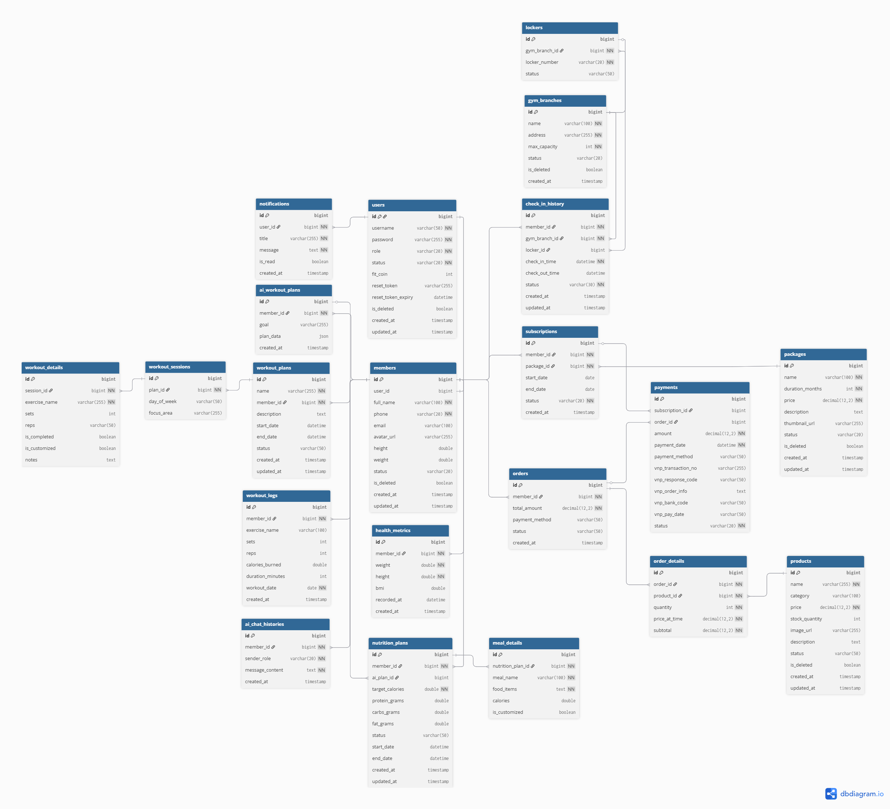

# ⚙️ FitLife Backend - Core API & Business Logic

[]()
[]()
[]()
[]()

> The robust core engine of FitLife. Architected for high performance, strict data integrity, and seamless third-party integrations.

## 🏗️ Architectural Patterns & Principles
As a foundational step towards scalable enterprise systems, this backend strictly adheres to:
- **N-Tier Architecture:** Clear separation of Controllers, Services, and Repositories.
- **Data Transfer Object (DTO) Pattern:** Powered by **MapStruct** to ensure Entities are never exposed to the presentation layer.
- **Global Exception Handling:** Utilizing `@RestControllerAdvice` to guarantee a unified `ApiResponse<T>` JSON contract across all endpoints.

## 🔥 Key Technical Implementations
- **AI-Driven Personalization:** Integrated **Google Gemini API** using custom prompts to generate strict JSON-locked workout and nutrition plans. Built-in fallback mechanisms handle AI hallucination risks.
- **Secure E-Commerce:** Implemented **VNPay** gateway integration. Secured the IPN Webhook using **HMAC SHA-512** checksum validation to prevent URL tampering and ensure financial integrity.
- **High-Speed Check-in (<100ms):** Leveraged **Redis** to cache user subscription states, bypassing slow RDBMS disk reads during peak hours.
- **Database Optimization:** Eliminated Hibernate **N+1 Query** anomalies by strategically applying `FetchType.LAZY` and custom `@Query` with JOIN FETCH. Implemented global Soft Delete (`is_deleted = true`).

## 🗄️ Database Schema (ERD)


## 🧪 Testing & Quality Assurance
- **Unit Testing:** Comprehensive test coverage for critical business logic (e.g., VNPay Checksum Validation, JWT Parsing) using **JUnit 5**.
- **Mocking:** Isolated external dependencies (Gemini API, Database calls) using **Mockito**.
- **API Testing:** Automated testing scripts maintained via **IntelliJ HTTP Client** (`/test-requests` directory).

## 🚀 Getting Started (Local Development)

### 1. Infrastructure Setup (Docker)
Ensure Docker is running, then spin up the MySQL and Redis containers:
```bash
docker-compose up -d
```
### 2. Environment Configuration
Create an `application-dev.yml` in `src/main/resources`:
```yaml
spring:
  datasource:
    url: jdbc:mysql://localhost:3306/fitlife_db
    username: root
    password: rootpassword
    
# Third-party Keys
gemini.api.key: YOUR_GEMINI_KEY
vnpay.tmn.code: YOUR_VNPAY_CODE
vnpay.hash.secret: YOUR_VNPAY_SECRET
jwt.secret: YOUR_JWT_SECRET
```
### 3. Build & Run
```bash
mvn clean install
mvn spring-boot:run
```
## 📖 API Documentation(Open API 3.0)
The API contract is auto-generated and interactive. Once the server is running, visit:
- Local: `http://localhost:8080/swagger-ui.html`